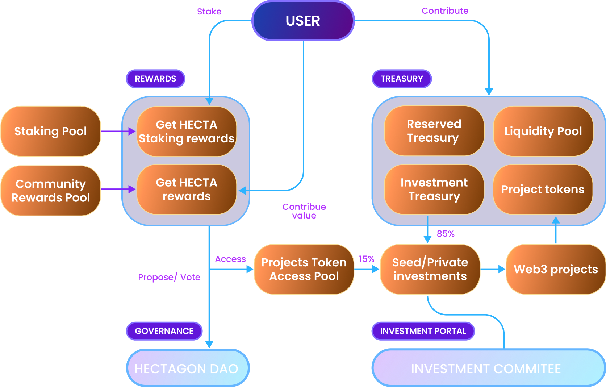

# 
## Core Smart Contracts

The world’s first DAO-governed Web3 Venture Capital funding platform for everyone
### Useful links

1. [Hectagon Docs](https://docs.hectagon.finance/)
1. [Hectagon HomePage](https://hectagon.finance/)
1. [Hectagon App](https://app.hectagon.finance/)

## Overview

# 

###  🔧 Setting up local development

Requirements:
- [Node v14](https://nodejs.org/download/release/latest-v14.x/)  
- [Git](https://git-scm.com/downloads)

Local Setup Steps:
1. ``git clone``
1. Install dependencies: `npm install` 
    - Installs [Hardhat](https://hardhat.org/getting-started/) and [OpenZepplin](https://docs.openzeppelin.com/contracts/4.x/) dependencies
1. Compile Solidity: ``npm run compile``
1. **_TODO_**: How to do local deployments of the contracts

